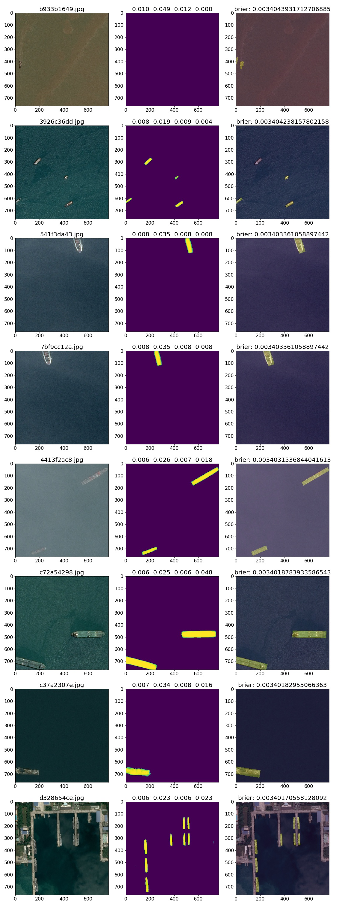

# Airbus_SDC
Code for the Kaggle competition "Airbus Ship Detection Challenge"

# Implementation Details

In this competition I explored a host of new ideas:

 1. Importance Sampling and image weighting.
 2. Ship Cropping and image scaling.
 3. [U-Nets](https://arxiv.org/pdf/1505.04597.pdf)
 3. Global Convolutional Nets ([GCN](https://arxiv.org/pdf/1703.02719.pdf))
 4. Spatial and Channel Squeeze & Excitation ([scSE](https://arxiv.org/pdf/1808.08127.pdf)) Blocks
 
Here are some of the results (middle column) from my best (0.82) submission.

